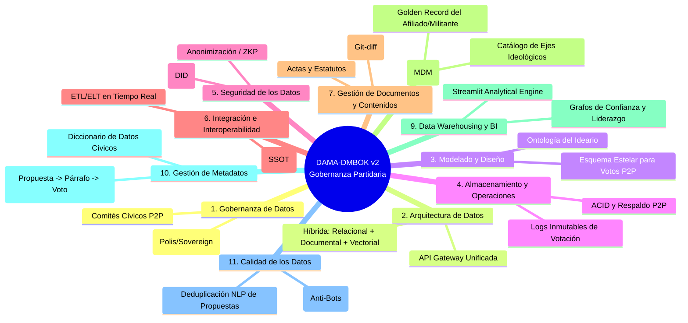

# Plan de Implementación: Ecosistema Modular de Gobernanza P2P e Inteligencia Partidaria bajo Marco DAMA-DMBOK

Este documento presenta el plan de arquitectura e implementación para construir una **Plataforma Integral de Gobernanza P2P, Democracia Líquida y Levantamiento de Datos en Tiempo Real** para la actividad y construcción del ideario de un partido político.

El plan articula la **complementariedad estratégica** de los principales repositorios *open-source* de democracia participativa y el uso de **Streamlit** como capa analítica, gobernados transversalmente por las 11 Áreas de Conocimiento del **Marco DAMA-DMBOK (Data Management Body of Knowledge)**.

---

## 1. Visión y Complementariedad Modular de los Repositorios

En lugar de depender de un solo sistema monolítico que intente resolver todo mediocremente, la arquitectura extrae **la funcionalidad de mayor valor y madurez técnica** de cada repositorio para cubrir el ciclo de vida completo de la actividad partidaria:

```mermaid
graph TB
    subgraph CAPA_INTAKE ["1. Captura y Levantamiento (Streamlit + Adhocracy)"]
        S_FORM[Streamlit Forms & Encuestas]
        A_MICRO[Adhocracy+ Micro-ideación]
    end

    subgraph CAPA_DELIBERACION ["2. Redacción e Inteligencia Colectiva (Consul + Polis)"]
        C_LEG[Consul Democracy: Legislación Colaborativa<br/>Redacción Párrafo a Párrafo del Ideario]
        P_AI[Polis: IA Deliberativa<br/>Clustering de Facciones y Consenso Puente]
    end

    subgraph CAPA_VOTACION ["3. Democracia Líquida y Voto P2P (Sovereign + Decidim)"]
        SOV[Sovereign: Motor de Tokens P2P<br/>y Delegación Líquida Revocable por Ejes]
        DEC[Decidim: Fases de Proceso<br/>y Rendición de Cuentas (Accountability)]
    end

    subgraph CAPA_ANALYTICS ["4. BI y Monitoreo en Tiempo Real (Streamlit Dashboard)"]
        ST_BI[Streamlit Executive BI & DAMA Dashboard<br/>Grafo de Liderazgos, Polarización y Calidad de Datos]
    end

    CAPA_INTAKE -->|JSON/API| CAPA_DELIBERACION
    CAPA_DELIBERACION -->|Textos Consensuados| CAPA_VOTACION
    CAPA_VOTACION -->|Transacciones & Tokens| CAPA_ANALYTICS
    CAPA_DELIBERACION -->|Vectores PCA/K-Means| CAPA_ANALYTICS
```

### Matriz de Complementariedad y Valor Extraído por Repositorio

| Repositorio | Valor Extraído para la Actividad Partidaria | Rol en la Arquitectura P2P / Democracia Líquida |
| :--- | :--- | :--- |
| **Sovereign** (`OpenSourcePolitics/DemocracyEarth`) | **Motor de Tokens y Delegación Líquida.** Gestión de balances de voto asignados por militante e infraestructura de delegación fluida por ejes temáticos (ej. Economía, Salud, Ambiente). | Capa de Transacciones y Confianza P2P (*Liquid Voting Engine*). |
| **Consul Democracy** | **Módulo de Legislación Colaborativa (*Collaborative Legislation*).** Permite publicar el borrador del *Ideario* para que las bases comenten, propongan enmiendas y voten **párrafo por párrafo**. | Capa de Redacción Normativa y Co-creación Estatutaria. |
| **Polis** | **Motor IA de Mapeo de Consenso (*AI Deliberation*).** Algoritmos de clustering (PCA/K-Means) que agrupan opiniones abiertas de militantes en tiempo real, identificando los acuerdos que unen a facciones opuestas y evitando rupturas. | Capa de Inteligencia Deliberativa y Mitigación de Polarización. |
| **Decidim** | **Ciclo de Vida de Procesos y Rendición de Cuentas (*Accountability*).** Estructura formalmente las fases del calendario partidario (Consulta $\rightarrow$ Enmiendas $\rightarrow$ Votación) y monitorea el cumplimiento de las propuestas aprobadas. | Capa Institucional, Trazabilidad y Auditoría Cívica. |
| **Streamlit** | **Intake Ciudadano + BI Dashboard en Tiempo Real.** Formularios ágiles de captación territorial, encuestas de pulso y dashboards ejecutivos para visualizar grafos de delegación, termómetros de polarización y métricas de gobernanza. | Capa de Presentación, Captura Territorial e Inteligencia de Partido. |

---

## 2. Gobernanza de Datos bajo el Marco DAMA-DMBOK

Para que un partido político opere con legitimidad, transparencia y robustez analítica, todos los flujos de datos producidos por la militancia y las herramientas P2P deben regirse por las **11 Áreas de Conocimiento de DAMA-DMBOK v2**:



### Detalle Operativo por Área DAMA-DMBOK

#### 1. Gobernanza de Datos (*Data Governance*)
* **Políticas y Estructura:** Definición de un *Consejo de Gobernanza de Datos Cívicos* distribuido (utilizando los líderes orgánicos detectados por la delegación líquida de Sovereign como *Data Stewards*).
* **Ética y Transparencia:** Publicación abierta del código y políticas de privacidad en el tratamiento de opiniones políticas y variables sensibles de los afiliados.

#### 2. Arquitectura de Datos (*Data Architecture*)
* **Modelo Híbrido Políglota:**
  * **Relacional (`PostgreSQL`):** Para Consul (textos del ideario y enmiendas) y Decidim (fases del proceso).
  * **Documental (`MongoDB`):** Para Sovereign (balances de tokens, transacciones de voto y grafo de delegación P2P).
  * **Analítico/Vectorial:** Para Polis (matrices de opinión y vectores de clustering) y Streamlit (caché en memoria/Parquet).
* **Capa de Interoperabilidad (API Gateway):** Un conector central que expone vistas unificadas para el tablero en tiempo real.

#### 3. Modelado y Diseño de Datos (*Data Modeling & Design*)
* **Ontología Estándar del Partido:** Definición de modelos lógicos y físicos para `Afiliado`, `Eje_Tematico`, `Propuesta`, `Enmienda`, `Delegacion_Liquida` y `Transaccion_Voto`.
* **Esquema de Hechos y Dimensiones:** Para reporting histórico en Streamlit (Hecho: `Voto_Emitido`; Dimensiones: `Tiempo`, `Territorio`, `Eje_Ideologico`, `Tipo_Delegacion`).

#### 4. Almacenamiento y Operaciones (*Data Storage & Operations*)
* **Inmutabilidad y Auditoría:** Registro transaccional (*Audit Logs*) inmutable de todas las delegaciones de voto en Sovereign para garantizar que no existan manipulaciones en los balances de poder de los militantes.
* **Disponibilidad Territorial:** Replicación de bases de datos para asegurar acceso ininterrumpido en asambleas remotas o votaciones masivas en tiempo real.

#### 5. Seguridad de los Datos (*Data Security*)
* **Identidad Soberana (DID & Verifiable Credentials):** Implementación de claves criptográficas personales para el voto en Sovereign, protegiendo al militante contra suplantaciones.
* **Privacidad y Voto Secreto:** Disociación criptográfica entre la identidad legal del militante (Golden Record) y la emisión del voto final en el ideario (*Zero-Knowledge Proofs* o seudonimización robusta).
* **RBAC (Role-Based Access Control):** Permisos diferenciados entre simpatizante, militante verificado, delegado temático y administrador de sistema.

#### 6. Integración e Interoperabilidad (*Data Integration & Interoperability*)
* **Pipelines de Tiempo Real:** Flujos ETL/ELT en Python que extraen continuamente las nuevas encuestas y borradores desde Streamlit y Consul, y los sincronizan hacia Sovereign para su votación.
* **Fuente Única de Verdad (*Single Source of Truth - SSOT*):** Sincronización continua de identidades y permisos entre todas las herramientas modulares mediante un proveedor de identidad único (OAuth2/OIDC con firma criptográfica).

#### 7. Gestión de Documentos y Contenidos (*Document & Content Management*)
* **Control de Versiones de Párrafos (*Git-like Versioning*):** Registro estructurado de cada cambio, enmienda aprobada y derogación de artículos dentro de Consul, manteniendo el histórico exacto de cómo evolucionó el ideario desde su fundación.

#### 8. Datos Maestros y de Referencia (*Master Data Management - MDM*)
* **Golden Record del Afiliado (`Afiliado_Master`):** Unificación y depuración continua del padrón de militantes para eliminar duplicados, vinculando su verificación territorial, áreas de experticia y estado de afiliación.
* **Catálogo Maestro de Ejes Temáticos:** Taxonomía única y controlada de temas del partido (ej. `[ECO-01] Política Fiscal`, `[SAL-03] Salud Mental`, etc.) coherente en todas las herramientas.

#### 9. Data Warehousing e Inteligencia de Negocio (*DW & Business Intelligence*)
* **Motor Analítico en Streamlit:** Creación del *Cerebro Analítico Partidario*. Un portal interactivo que consume el Data Warehouse para responder preguntas estratégicas en tiempo real (ver sección de Dashboards).

#### 10. Gestión de Metadatos (*Metadata Management*)
* **Linaje de Datos Cívicos (*Data Lineage*):** Capacidad técnica en Streamlit y la base de datos para rastrear el origen exacto de un párrafo del Ideario: *¿Qué ciudadano lo propuso en el formulario $\rightarrow$ En qué debate de Polis se validó el consenso $\rightarrow$ Con cuántos votos líquidos de Sovereign se aprobó?*
* **Catálogo y Diccionario de Datos:** Documentación accesible de cada métrica y fórmula de cálculo (ej. cómo se calcula el "Índice de Consenso" o el "Peso de Delegación").

#### 11. Calidad de los Datos (*Data Quality*)
* **Resistencia a Ataques Sybil (Anti-Bots):** Validación multi-factor (DNI/Móvil/Prueba de Humanidad) para evitar que cuentas falsas alteren votaciones o encuestas en Streamlit.
* **Deduplicación Semántica mediante NLP:** Uso de embeddings y modelos de lenguaje en Python para detectar cuando dos comités locales proponen exactamente la misma idea para el ideario, sugiriendo su fusión antes del voto.
* **Monitoreo de Anomalías:** Alertas automáticas en Streamlit si se detecta una concentración anormal de delegación de votos en pocos segundos o en una sola IP.

---

## 3. Flujo Operativo Integral: De la Calle al Ideario Consolidado

A continuación se detalla cómo interactúa un ciudadano o militante con el ecosistema P2P en un ciclo participativo estándar:

```
[Militante/Ciudadano]
       │
       ├─ 1. Ingresa a App Streamlit (Formulario Móvil en la Calle/Asamblea)
       │     └─ Envía propuesta en crudo o responde encuesta diagnóstica.
       │     └─ (DAMA Calidad: NLP verifica duplicados y normaliza taxonomía).
       │
       ├─ 2. Pasa a Deliberación en Polis y Consul
       │     ├─ En Polis: Vota "De acuerdo / En desacuerdo" con afirmaciones ágiles.
       │     │            El motor ML detecta que su propuesta une a facciones del partido.
       │     └─ En Consul: El texto se redacta como Párrafo Formal del Ideario.
       │                   Se abren comentarios y enmiendas de redacción.
       │
       ├─ 3. Votación Líquida en Sovereign (Democracia P2P)
       │     ├─ Opción A: Vota directamente con sus tokens de voto en el párrafo final.
       │     └─ Opción B: Si es un tema técnico (ej. Reforma Tributaria), delega sus tokens
       │                  al "Portavoz de Economía" en el que confía.
       │
       └─ 4. Visualización en Tiempo Real en Streamlit Dashboard
             └─ La dirección del partido y las bases observan la aprobación del inciso,
                el grafo de quiénes lideran la confianza técnica y el linaje DAMA del texto.
```

---

## 4. Estructura del Workspace y Código Propuesto

Para iniciar de inmediato con la infraestructura en tu espacio de trabajo local (`c:/Users/David/Documents/GobernanzaP2P`), se propone organizar el repositorio del partido con una arquitectura contenerizada moderna y modular:

```
c:/Users/David/Documents/GobernanzaP2P/
├── docker-compose.yml                 # Orquestador: Mongo + Postgres + Sovereign + Streamlit + API
├── .env.example                       # Variables de entorno y secretos criptográficos (DID/JWT)
├── config/
│   ├── dama_ontology.json             # Taxonomía y Ejes Maestros (MDM)
│   └── governance_rules.yaml          # Parámetros de delegación y pesos de tokens en Sovereign
├── intake_surveys/                    # Módulo Streamlit 1: Captura Territorial y Formularios
│   ├── app_intake.py
│   ├── nlp_deduplication.py           # Deduplicador semántico de propuestas cívicas
│   └── schema_validation.py           # Validación de calidad DAMA
├── analytics_dashboard/               # Módulo Streamlit 2: BI, Liderazgos y Monitoreo DAMA
│   ├── app_dashboard.py
│   ├── components/
│   │   ├── leadership_graph.py        # Grafo de red P2P (NetworkX/PyVis) de delegaciones Sovereign
│   │   ├── polis_clustering.py        # Visualización de PCA/K-Means de consenso
│   │   └── dama_quality_metrics.py    # Tablero de salud y linaje del dato partidario
│   └── queries/
│       ├── mongo_sovereign.py         # Consultas transaccionales a tokens y votos
│       └── postgres_consul.py         # Consultas a párrafos del ideario en redacción
└── etl_pipelines/                     # Scripts de sincronización e interoperabilidad P2P
    ├── sync_intake_to_consul.py
    └── sync_consul_to_sovereign.py
```

---

## 5. Próximos Pasos de Ejecución y Revisión Requerida

### Revisión Requerida por el Usuario
1. **Prioridad Inicial de Despliegue:** ¿Deseas que montemos primero la **arquitectura local completa en Docker Compose** con todas las bases de datos ficticias y conectadas, o prefieres que desarrollemos primero los **prototipos funcionales de Streamlit** (`intake_surveys` y `analytics_dashboard`) usando datos simulados de votación P2P?
2. **Nivel de Integración Criptográfica:** ¿Deseas que incluyamos desde el día 1 la generación de claves o tokens locales tipo DID/Sovereign en Python para simular exactamente cómo se firman los votos en el dashboard, o iniciamos con un esquema de autenticación estándar e identificadores de usuario?

### Plan de Verificación Técnica
* **Automático:** Ejecución de scripts de prueba de carga y validación de esquema DAMA (`pytest` en pipelines de deduplicación e inserción de transacciones líquidas sin pérdida de integridad de tokens).
* **Manual:** Simulación en vivo de una votación multicategórica donde el usuario delega 50 tokens a un perfil experto en Streamlit, el experto vota un párrafo en Sovereign, y se verifica en tiempo real la actualización del grafo de liderazgo y la aprobación del inciso del ideario.
